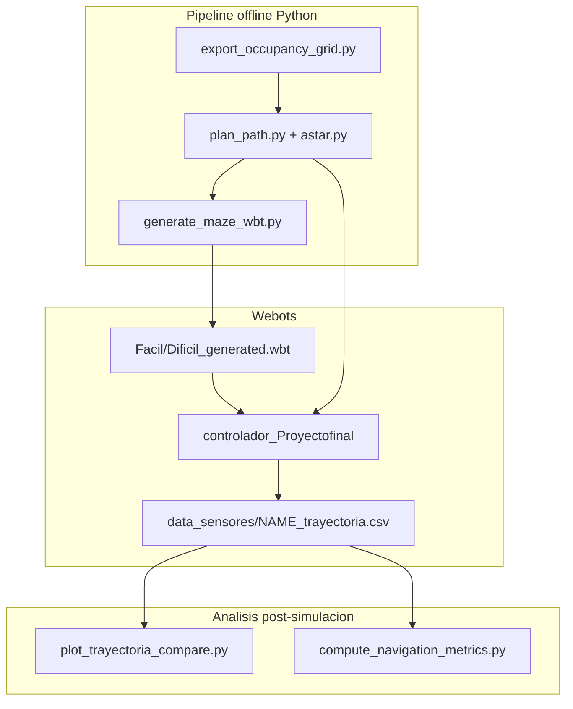
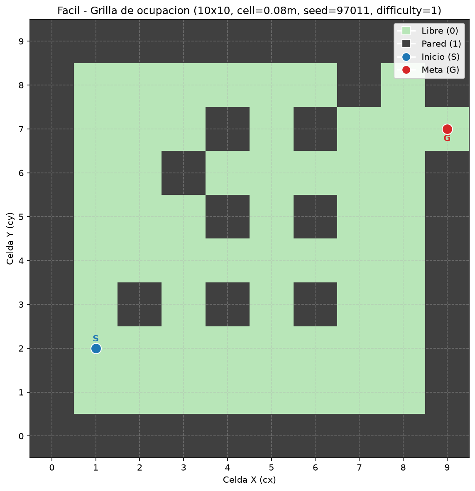
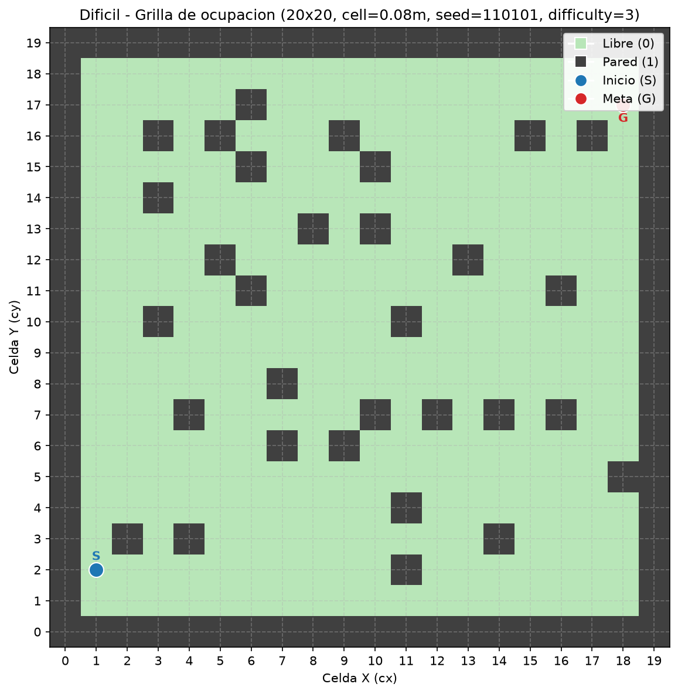
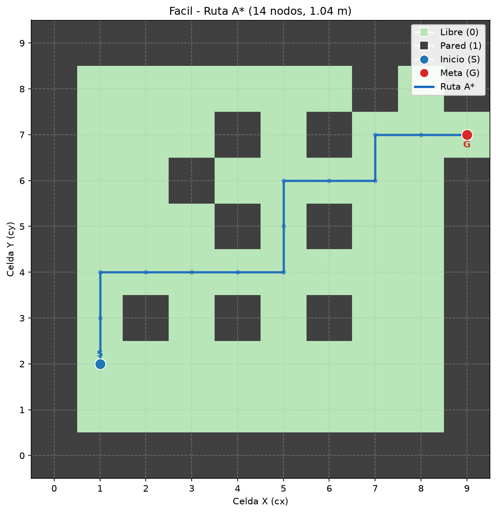
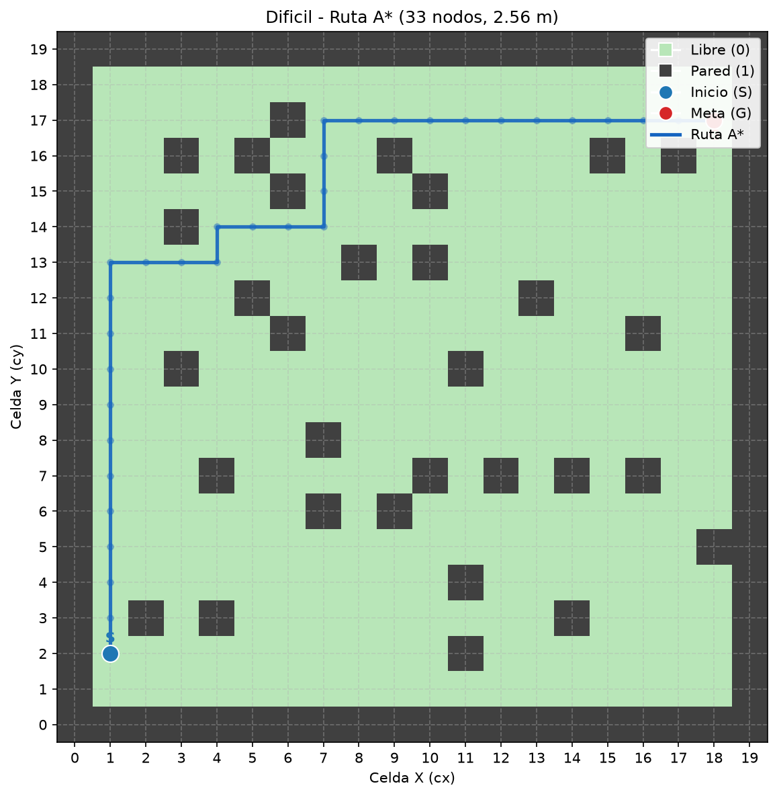
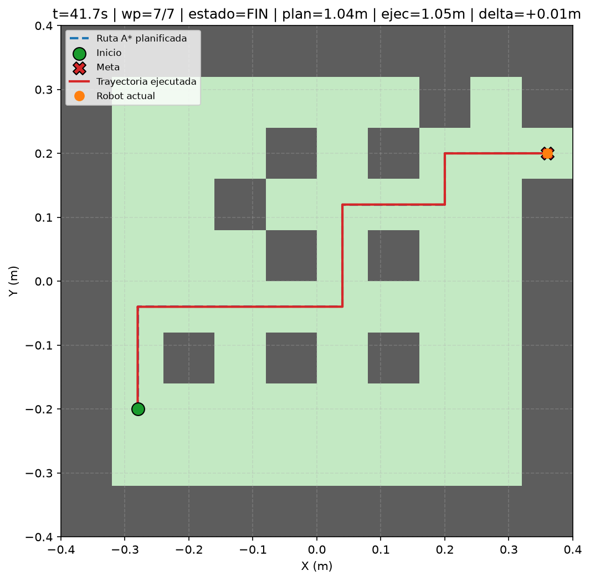

# Proyecto Final: Navegación Autónoma con Planificación A*

## Integrantes

- Maura Gonzalez
- Guadalupe Marin
- Rodrigo Rojas
- Ricardo Toro

**Línea de desarrollo seleccionada:** Planificación de rutas (A* sobre grilla de ocupación)

---

## Objetivo del Proyecto

Diseñar, implementar y evaluar un sistema de navegación autónoma para un robot móvil diferencial (e-puck) en Webots. El robot debe desplazarse desde una posición inicial hasta una meta dentro de un entorno con obstáculos, utilizando planificación global sobre una grilla de ocupación y ejecución local basada en odometría.

El resultado esperado es que el robot llegue de forma autónoma a la meta en al menos dos escenarios (simple y complejo), siguiendo una ruta planificada y registrando la trayectoria ejecutada para compararla con la ruta teórica.

---

## Descripción del Robot, Sensores y Actuadores

### Robot y actuadores

| Elemento | Detalle |
| :--- | :--- |
| **Modelo** | e-puck (robot diferencial) |
| **Motores** | `left wheel motor`, `right wheel motor` (velocidad angular) |
| **Radio de rueda** ($r$) | 0.0205 m |
| **Distancia entre ejes** ($L$) | 0.052 m |
| **Velocidad angular máxima** | 6.28 rad/s |

El controlador convierte comandos de avance y giro en velocidades de rueda usando la cinemática diferencial estándar.

### Sensores utilizados en el controlador final

| Sensor | Uso en este proyecto |
| :--- | :--- |
| **Encoders** (`left wheel sensor`, `right wheel sensor`) | Odometría en tiempo real: estimación de $(x, y, \phi)$, cierre de giros y segmentos rectos |
| **Sensores PS0–PS7** (proximidad IR del e-puck) | Disponibles en el modelo, pero **no leídos** por el controlador de navegación final |

### Nota sobre evitación de obstáculos

La evitación de colisiones se garantiza mediante **planificación global** sobre una grilla de ocupación exportada offline: A* solo transita celdas libres y el mundo Webots se genera a partir de esa misma grilla. No se implementó una capa reactiva con sensores de proximidad en el controlador final; esto se documenta como limitación y mejora futura (ver sección de conclusiones).

---

## Arquitectura del Sistema


---

## Escenarios de Prueba

Se evaluó el sistema en dos escenarios, generados proceduralmente con semilla y dificultad distintas:

| Escenario | Archivo Webots | Grilla | Semilla | Dificultad | Inicio (celda → m) | Meta (celda → m) |
| :--- | :--- | :---: | :---: | :---: | :--- | :--- |
| **Simple** | `worlds/Facil_generated.wbt` | 10×10, celda 0.08 m | 97011 | 1 | (1, 2) → (-0.28, -0.20) | (9, 7) → (0.36, 0.20) |
| **Complejo** | `worlds/Dificil_generated.wbt` | 20×20, celda 0.08 m | 110101 | 3 | (1, 2) → (-0.68, -0.60) | (18, 17) → (0.68, 0.60) |

- **Escenario simple:** pocos obstáculos, pasillos amplios, ruta relativamente directa (7 segmentos rectos).
- **Escenario complejo:** mayor densidad de paredes, pasillos más estrechos y más giros (33 celdas en la ruta A*, simplificadas a 7 segmentos).

Cada mundo incluye marcadores `START_MARKER` y `GOAL_MARKER`, paredes alineadas a la grilla y el controlador `controlador_Proyectofinal` con los argumentos `--path` y `--csv` embebidos.

---

## Componentes del Sistema (Requisitos del Proyecto)

| Componente | Implementación |
| :--- | :--- |
| **Control de movimiento** | Motores diferenciales;  `GIRAR` / `AVANZAR` / `FIN` en [`controllers/controlador_Proyectofinal/controlador_Proyectofinal.py`](controllers/controlador_Proyectofinal/controlador_Proyectofinal.py) |
| **Percepción del entorno** | Grilla de ocupación exportada offline (`scripts/output/{name}_grid.json`); representación 2D del laberinto |
| **Estimación de movimiento** | Odometría diferencial desde encoders con integración de punto medio |
| **Navegación local** | Seguimiento de segmentos rectos y giros en el sitio con tolerancias `SEGMENT_TOL` y `TURN_TOL` |
| **Navegación global** | A* 4-vecinos con heurística Manhattan  |
| **Evaluación experimental** | CSV de trayectoria, gráficos comparativos y métricas cuantitativas (`scripts/navigation_metrics.py`) |

---

## Algoritmo de Planificación Global (A*)

### Representación del entorno

El entorno se discretiza en una **matriz 2D de ocupación** (`0` = libre, `1` = pared). Las coordenadas de celda se convierten a metros con `cell_to_world()` según el tamaño de celda y el origen definidos en cada escenario.

### Planificación

1. **Exportar grilla:** `export_occupancy_grid.py` genera el laberinto y se almacena en `{name}_grid.json`.
2. **Planificar ruta:** `plan_path.py` ejecuta A* desde la celda de inicio hasta la meta.
3. **Simplificar trayectoria:** `simplify_path()` conserva solo los extremos de cada segmento recto (inicio, esquinas y meta), reduciendo waypoints innecesarios.
4. **Generar mundo:** `generate_maze_wbt.py` crea el `.wbt` con paredes, marcadores y controlador configurado.

En el escenario **Facil**, la ruta A* tiene **14 celdas** que se reducen a **7 waypoints** (7 segmentos). En **Dificil**, **33 celdas** → **7 segmentos**.

### Pseudocódigo A*

```python
Funcion A*(grilla, inicio, meta):
    lista_abierta = HeapPriorityQueue(inicio)
    padres = {inicio: None}
    costo_g = {inicio: 0}

    Mientras lista_abierta no este vacia:
        actual = lista_abierta.pop_menor_f()
        Si actual == meta:
            retornar reconstruir_ruta(padres, meta)

        Para cada vecino en [Norte, Sur, Este, Oeste]:
            Si vecino es libre y dentro de limites:
                nuevo_g = costo_g[actual] + 1
                Si nuevo_g < costo_g.get(vecino, inf):
                    costo_g[vecino] = nuevo_g
                    f = nuevo_g + Manhattan(vecino, meta)
                    lista_abierta.push(vecino, f)
                    padres[vecino] = actual

    retornar None  # sin ruta
```

Tras obtener `path_cells`, se aplica `simplify_path()` y se convierte a coordenadas del mundo (`path_world`) para el seguimiento del robot.

### Seguimiento de la ruta

El controlador carga `path_world` desde el JSON y, por cada segmento:

1. **GIRAR:** alinea la orientación con el eje del segmento (X o Y).
2. **AVANZAR:** recorre la distancia restante sobre un solo eje con control proporcional (`K_RHO`).
3. Al completar el último waypoint, pasa a **FIN** y detiene los motores.

La pose se estima integrando encoders:

- $\Delta s = \frac{r(\Delta\theta_{der} + \Delta\theta_{izq})}{2}$
- $\Delta\phi = \frac{r(\Delta\theta_{der} - \Delta\theta_{izq})}{L}$
- $x, y$ se actualizan con integración de punto medio sobre $\phi$

---

## Relación con Laboratorios 1 y 2

### Laboratorio 1 — Cinemática diferencial

El proyecto **reutiliza directamente** lo aprendido en el Lab 1:

- Modelo cinemático del e-puck con parámetros $r$ y $L$.
- Conversión entre velocidades de rueda y movimiento del robot.
- Integración de encoders para estimar desplazamiento y orientación (`DifferentialDrive.update_odometry()`).
- Control de giros en el sitio y avance recto mediante `apply_wheel_speeds()`.

El Lab 1 cubrió el movimiento local; este proyecto lo **extiende** con una meta global y una secuencia de waypoints planificada con A*.

### Laboratorio 2 — Percepción y filtrado

En el Lab 2 se trabajó la lectura de sensores de proximidad (PS0–PS7), filtrado EMA y estimación con filtro de Kalman. **En el controlador final de navegación**, la fusión sensorial (EMA/Kalman) **no está integrada**: la percepción del entorno para la planificación proviene de la grilla exportada offline, y la estimación en tiempo de ejecución se basa en encoders. Integrar la capa reactiva del Lab 2 con la ruta planificada queda como mejora futura explícita, si se hubiera implementado SLAM, el laboratorio 2 se vería más reflejado debido a la reactividad que adquiere el robot.

---

## Resultados y Métricas de Desempeño

Las métricas se calcularon con [`scripts/compute_navigation_metrics.py`](scripts/compute_navigation_metrics.py) a partir de los CSV de trayectoria y los JSON de ruta planificada.

### Métricas cuantitativas (ejecución documentada)

| Métrica | Escenario Facil | Escenario Dificil |
| :--- | :---: | :---: |
| Tiempo total hasta la meta (s) | 37.536 | 62.880 |
| Longitud ruta planificada (m) | 1.04 | 2.56 |
| Longitud trayectoria ejecutada (m) | 1.0456 | 2.5646 |
| Diferencia planificada vs ejecutada (m) | +0.0056 | +0.0046 |
| Error de posición final (m) | 0.00012 | 0.00047 |
| Llegada a la meta | Sí | No |

### Análisis comparativo

- En la simulación, el escenario Fácil consiguió finalizar sin problemas con los parametros mostrados en la tabla. Sin embargo, el escenario Dificil tuvo mayores complicaciones, debido a una mayor cantidad de giro y distancia que debió recorrer. Esto se vio reflejado en giros incompletos y distancias inconclusas que impidieron al robot llegar a su objetivo

### Métricas no implementadas (limitación)

Las siguientes métricas sugeridas por la rúbrica **no fueron medidas automáticamente** en esta versión:

- Número de colisiones o casi colisiones
- Número de giros innecesarios
- Estabilidad de mediciones crudas vs filtradas (Lab 2)
- Porcentaje de éxito en múltiples repeticiones

---

## Evidencias Visuales

### Grillas de ocupación y rutas A*

| Escenario simple (Facil) | Escenario complejo (Dificil) |
| :---: | :---: |
|  |  |
|  |  |

### Ruta planificada vs trayectoria ejecutada

| Escenario simple (Facil) |
| :---: |
|  | !


### Video demostrativo

[DemoControladorFacil.mp4](DemoControladorFacil.mp4) — ejecución del robot en Webots en el escenario Facil.

[DemoControladorDificil.mp4](DemoControladorDificil.mp4) — ejecución del robot en Webots en el escenario Dificil.

---

## Instrucciones para Ejecutar la Simulación

### Requisitos

- **Webots R2025a**
- **Python 3.10+** con `matplotlib` y `pandas`

### Clonar el repositorio

```bash
git clone https://github.com/Ratinaxo/controlador-robotica.git
cd controlador-robotica
```

### Escenario Facil (simple)

```bash
cd scripts

# 1. Generar grilla de ocupación
python export_occupancy_grid.py \
  --name Facil --start-cell 1,2 --goal-cell 9,7 \
  --grid-size 10 --cell-size 0.08 --seed 97011 --difficulty 1

# 2. Planificar ruta A* y guardar PNG
python plan_path.py --name Facil --plot --no-show

# 3. Generar mundo Webots
python generate_maze_wbt.py --name Facil
```

Abrir en Webots: `worlds/Facil_generated.wbt` (también disponible en `scripts/output/Facil_generated.wbt`). Colocar el e-puck sobre `START_MARKER` y presionar **Play**. El controlador registra la trayectoria en `data_sensores/Facil_trayectoria.csv`.

### Escenario Dificil (complejo)

```bash
cd scripts

python export_occupancy_grid.py \
  --name Dificil --start-cell 1,2 --goal-cell 18,17 \
  --grid-size 20 --cell-size 0.08 --seed 110101 --difficulty 3

python plan_path.py --name Dificil --plot --no-show
python generate_maze_wbt.py --name Dificil
```

Abrir en Webots: `worlds/Dificil_generated.wbt` y ejecutar igual que Facil.

### Post-procesamiento y análisis

```bash
cd scripts

# Comparar ruta planificada vs ejecutada (PNG estático)
python data_sensores/plot_trayectoria_compare.py \
  --name Facil --no-realtime --output output/Facil_trayectoria_compare.png

python data_sensores/plot_trayectoria_compare.py \
  --name Dificil --no-realtime --output output/Dificil_trayectoria_compare.png

# Métricas por escenario
python compute_navigation_metrics.py --name Facil --no-show
python compute_navigation_metrics.py --name Dificil --no-show

# Gráfico comparativo Facil vs Dificil
python compute_navigation_metrics.py --compare Facil Dificil --no-show
```

Modo interactivo en tiempo real (durante o después de simular):

```bash
python data_sensores/plot_trayectoria_compare.py --name Facil
```

### Estructura del repositorio

```
controlador-robotica-Proyectofinal/
├── controllers/
│   └── controlador_Proyectofinal/   # Controlador Webots
├── worlds/
│   ├── Facil_generated.wbt          # Escenario facil
│   └── Dificil_generated.wbt          # Escenario dificil
├── scripts/
│   ├── export_occupancy_grid.py     # Generar grilla/matriz JSON/CSV
│   ├── plan_path.py                 # A* + export path JSON
│   ├── astar.py                     # Algoritmo A* y simplify_path para reducir waypoints
│   ├── generate_maze_wbt.py         # Mundo Webots desde grilla
│   ├── compute_navigation_metrics.py
│   ├── navigation_metrics.py
│   ├── data_sensores/
│   │   └── plot_trayectoria_compare.py
│   └── output/                      # Grillas, rutas, métricas, PNG
├── data_sensores/
│   ├── Facil_trayectoria.csv        # Trayectoria ejecutada (Facil)
│   └── Dificil_trayectoria.csv      # Trayectoria ejecutada (Dificil)
├── DemoRobotica.mp4                 # Video demostrativo
└── README.md                        # Este informe técnico
```

---

## Conclusiones, Limitaciones y Posibles Mejoras

### Conclusiones

- El pipeline **Generar Matriz con laberinto → A* → Llevar a mundo Webots → seguimiento por waypoints** permite una navegación reproducible en ambos escenarios.
- La simplificación de la ruta (`simplify_path`) reduce calculos innecesarios y mejora la ejecución práctica y movimientos del robot.
- El robot alcanza la meta de forma estable en Facil sin colisiones observables.

### Limitaciones

- **Sin capa reactiva con sensores PS:** la evitación depende del mapa conocido; obstáculos no modelados en la grilla no serían detectados en tiempo de ejecución.
- **Grilla estática offline:** no hay SLAM ni construcción de mapa en tiempo real (Línea B no implementada).
- **Métricas parciales:** no se registran colisiones, giros innecesarios ni estadísticas de múltiples repeticiones.
- **Escenarios grandes:** en escenarios de mayor complejidad, donde el robot debe recorrer mayores distancias, el error acumulado de los giros afecta el rendimiento del robot, impidiendo finalizar los recorridos planificados por A*.
### Posibles mejoras

1. Integrar sensores PS con la lógica de filtrado del Lab 2 para corrección local y parada ante riesgo de colisión.
2. Replanificación online si la odometría se desvía significativamente de la ruta.
3. Suavizado de trayectorias (splines) para reducir detenciones en cada esquina.
4. Ejecutar N repeticiones por escenario y reportar media, desviación estándar y porcentaje de éxito.
5. Explorar Línea B (SLAM simplificado) para entornos parcialmente desconocidos.

