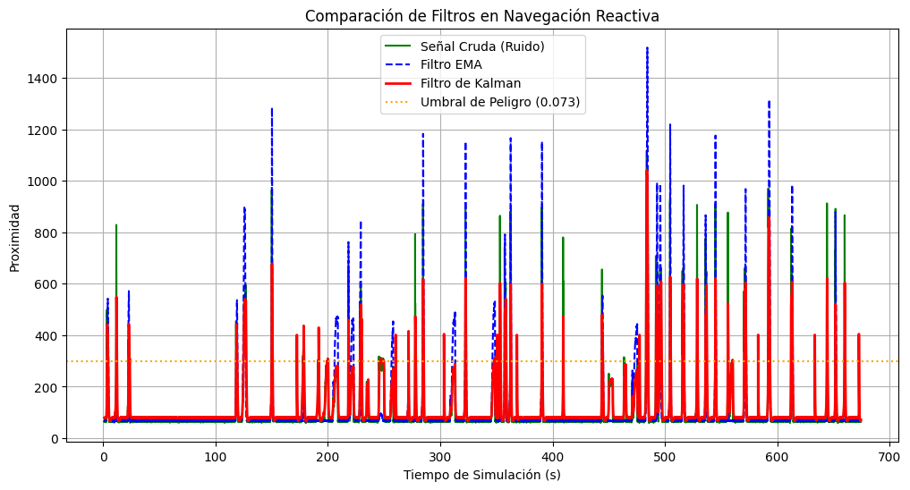
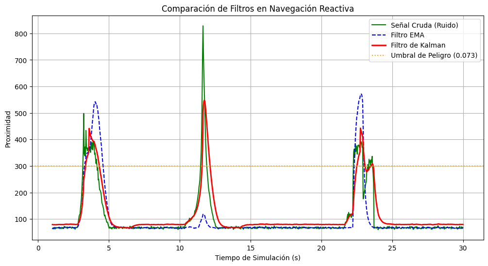
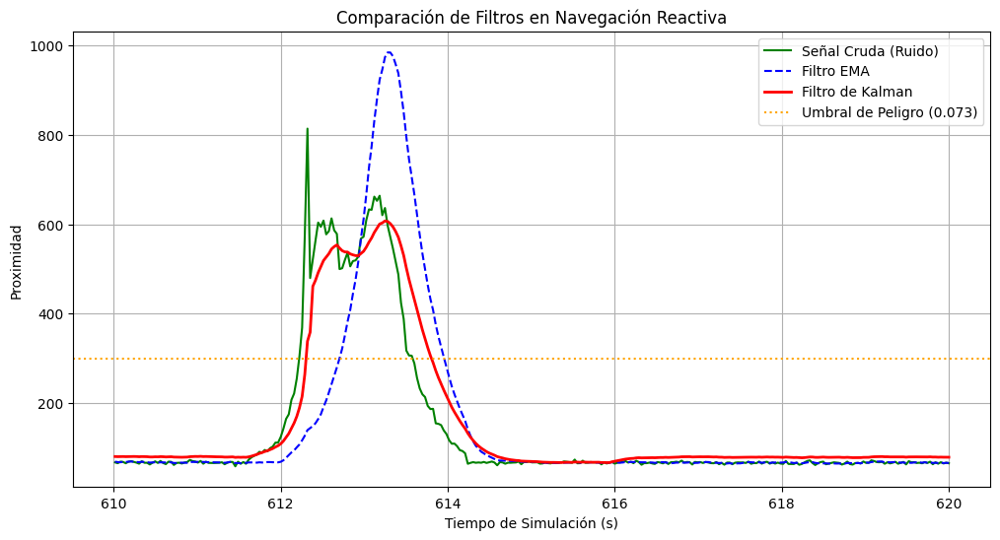
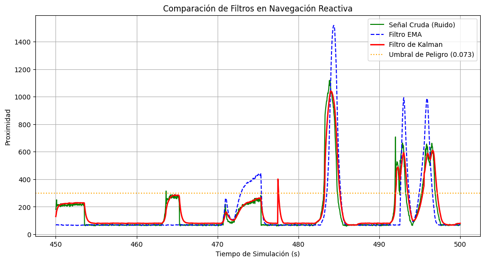

# Laboratorio 2: Navegación Reactiva con Filtrado y Fusión de Sensores en Webots

## Integrantes
* Maura Gonzalez
* Guadalupe Marin
* Rodrigo Rojas
* Ricardo Toro
---

## Requisitos Previos
* [Webots](https://cyberbotics.com/) (versión R2025a).
* [Python](https://www.python.org/) (versión 3.14)
* [Git](https://git-scm.com/) (opcional)


## Instrucciones para ejecutar la simulación

### Pasos

1. Crear nuevo directorio en Webots:
    - En Webots, seleccionar `File > New > New Project Directory...`
    - Seguir las instrucciones de creación de Webots

2. Clonar el repositorio:
   ```bash
   git clone --single-branch --branch Lab2 https://github.com/Ratinaxo/controlador-robotica.git
   cd controlador-robotica
   ```
   - Una vez clonado el archivo, tome los contenidos de la carpeta recien creada y muevala hacia la carpeta del proyecto creado por webots

3. Abrir Webots y cargar el mundo:
    - `File > Open World` y seleccionar uno de los mapas `.wbt` dentro del directorio `worlds/` del repositorio.
        -   MundoEz.wbt es un mundo "fácil" donde el entorno son únicamente cajas.
        -   MundoHard.wbt es un mundo "dificil" donde el entorno es un laberinto .
        
4. Asignar el controlador al robot:
   - Seleccionar el e-puck en la escena.
   - En el panel de propiedades, verificar que el controlador seleccionado sea `lab2_controlador.py`.

5. Ejecutar la simulación con el botón `play` de Webots.

    -    Antes de ejecutar la simulación, podemos ir al directorio `data_sensores/` y correr el script de python `plotter_realtime.py`, con esto podremos visualizar en tiempo real los datos crudos y filtrados de los sensores del e-puck.

6. Durante la ejecución, el archivo `datos_sensores.csv` se irá llenando con datos de los sensores se será almacenado en en el directorio `data_sensores/`.

7. Una vez finalizada la simulación podemos, podemos ir al directorio `data_sensores/` y visualizar los datos de los sensores con el script de python `plotter_estatico.py`.

## Objetivo

Implementar un sistema básico de navegación reactiva en Webots para un robot móvil diferencial, utilizando sensores de distancia y encoders de rueda, aplicando filtrado sobre las mediciones y empleando un filtro de Kalman para estimar la distancia frontal a obstáculos y mejorar la toma de decisiones.

---

## Robot y sensores utilizados

Se utilizó el robot **e-puck** de Webots, un robot diferencial con dos ruedas motrices independientes.

| Componente | Dispositivo Webots | Descripción |
|---|---|---|
| Motor izquierdo | `left wheel motor` | Rueda motriz izquierda |
| Motor derecho | `right wheel motor` | Rueda motriz derecha |
| Sensor frontal izq. | `ps7` | Sensor de proximidad frontal izquierdo |
| Sensor frontal der. | `ps0` | Sensor de proximidad frontal derecho |
| Sensor lateral izq. | `ps5` | Sensor de proximidad lateral izquierdo |
| Sensor lateral der. | `ps2` | Sensor de proximidad lateral derecho |
| Encoder izquierdo | `left wheel sensor` | Posición angular rueda izq. (rad) |
| Encoder derecho | `right wheel sensor` | Posición angular rueda der. (rad) |

**Radio de rueda:** `r = 0.0205 m`

Los sensores de proximidad del e-puck devuelven valores en un rango aproximado de `[0, 4095]`, donde **mayor valor indica mayor cercanía al obstáculo**. Se normalizan a `[0, 1]` para mantener unidades consistentes con el filtro de Kalman.

---

## Frecuencia de muestreo

El paso de simulación se obtiene directamente de Webots mediante `robot.getBasicTimeStep()`.  
Para el e-puck, el valor típico es `64 ms`, lo que da:

```
Ts = 0.064 s
fs = 1 / Ts ≈ 15.625 Hz
```

La frecuencia exacta se imprime al inicio de la simulación y depende de la configuración del mundo en Webots.

---

## Descripción de la solución implementada

### 1. Lectura de encoders y estimación de avance

Los encoders proporcionan la posición angular acumulada de cada rueda en radianes. En cada paso de simulación se calcula el desplazamiento diferencial:

```
Δθ_izq = θ_izq(k) - θ_izq(k-1)
Δθ_der = θ_der(k) - θ_der(k-1)
```

El desplazamiento lineal de cada rueda se obtiene con `s = r·θ`, y el avance estimado del robot es el promedio de ambas:

```
Δd_k = (s_izq + s_der) / 2
```

### 2. Lectura y normalización de sensores frontales

Se promedian las lecturas crudas de los dos sensores frontales (ps7 y ps0) para obtener un frente unificado.
Se trabaja directamente con la escala nativa del e-puck [0, 4095], donde entre mas grande el valor, más cerca estara el robot al obstáculo.

```
z_k = (ps7 + ps0) /2
```


### 3. Filtro simple (EMA — Promedio Móvil Exponencial)

Se aplica un filtro exponencial sobre `z_k` para reducir el ruido de alta frecuencia:

```
z_k_filtrado = α · z_k + (1 - α) · z_k_filtrado_anterior
```

Con `α = 0.2`, el filtro es relativamente suave: da mayor peso al historial pasado y reacciona lentamente a cambios bruscos, lo que reduce lecturas falsas.

### 4. Filtro de Kalman para estimación de distancia frontal

El filtro de Kalman combina la información de movimiento (encoders) con la medición del entorno (sensores frontales) para obtener una estimación más robusta de la proximidad frontal `d_k`.

#### Etapa de Predicción

A partir del avance estimado con encoders, se actualiza la estimación de proximidad (al avanzar, el robot se acerca al obstáculo):

```
d̂⁻_k = d̂_{k-1} + Δd_k_norm
P⁻_k  = P_{k-1} + Q
```

Donde `Q = 0.001` es el ruido del proceso (confianza en los encoders) y `P` es la covarianza de la estimación.

#### Etapa de Corrección

La predicción se corrige usando la medición del sensor frontal `z_k`:

```
K_k  = P⁻_k / (P⁻_k + R)
d̂_k  = d̂⁻_k + K_k · (z_k - d̂⁻_k)
P_k  = (1 - K_k) · P⁻_k
```

Donde `R = 0.05` es el ruido de medición (confianza en los sensores).

**Interpretación de la ganancia K_k:**
- Si `R` es grande (sensor ruidoso) → `K_k` pequeño → el filtro confía más en la predicción.
- Si `P⁻_k` es grande (predicción incierta) → `K_k` grande → el filtro confía más en la medición.

### 5. Lógica de navegación reactiva

La decisión de movimiento se toma comparando `d̂_k` (estimación Kalman normalizada) con un umbral de seguridad `UMBRAL_PELIGRO = 300.0`:

```
SI d̂_k > UMBRAL_PELIGRO:
    SI lateral_izq >= lateral_der:
        → GIRAR A LA DERECHA  (obstáculo más cerca por la izquierda)
    SINO:
        → GIRAR A LA IZQUIERDA (obstáculo más cerca por la derecha)
SINO:
    → AVANZAR RECTO
```

Los sensores laterales (`ps5` y `ps2`) determinan la dirección del giro cuando hay un obstáculo al frente, favoreciendo el lado con más espacio libre.

---

## Registro de datos

Todos los datos se almacenan en `datos_sensores.csv` con las siguientes columnas:

| Columna | Descripción |
|---|---|
| Tiempo (s) | Tiempo de simulación en segundos |
| Avance Estimado (m) | Δd_k calculado con encoders |
| Frontal Crudo z_k (norm) | Promedio frontal normalizado [0,1] |
| Frontal Filtrado (norm) | Señal EMA aplicada sobre z_k |
| Kalman d_k (norm) | Estimación fusionada Kalman [0,1] |
| Lateral Izq (raw) | Lectura cruda sensor ps5 |
| Lateral Der (raw) | Lectura cruda sensor ps2 |
| Accion | AVANCE / GIRO_DER / GIRO_IZQ |

---

## Gráficos de señales
### Gráfico de comparación de filtros (de 1 a 700 segundos)


### Gráfico de comparación de filtros (de 1 a 30 segundos)


### Gráfico de comparación de filtros (de 610 a 620 segundos)


### Gráfico de comparación de filtros (de 450 a 500 segundos)


Estos graficos dan una representación visual de:
- La volatilidad de la señal cruda de los sensores, muestra pics altos y señales inestables
- El suavizado y lentitud del filtro EMA, aun muestra pics grandes, pero estabiliza las señales que recibe el robot. tambien se ve como reacciona de manera tardia a la mayoria de obstaculos que encuentra.
- La corrección del filtro Kalman, el filtro reduce perfecciona los datos entregados por los sensores y por el EMA, dando una lectura de señales más estable y correcta para que el robot pueda reaccionar a tiempo

---

## Escenarios de prueba

### Escenario 1 — Entorno simple (pocos obstáculos)
- Una o dos cajas en el camino del robot.
- Se analiza si el robot detecta el obstáculo a tiempo, gira correctamente y retoma el avance.

### Escenario 2 — Entorno complejo (pasillo o laberinto)
- Múltiples obstáculos o paredes laterales cercanas.
- Se analiza la cantidad de giros, la estabilidad del movimiento y si el robot colisiona.

---

## Análisis y conclusiones

### Análisis de Señales
- Medición Cruda, Filtrada y con Kalman: La señal cruda del e-puck presenta un alto nivel de ruido, con pics falsos incluso cuando el entorno está relativamente libre. Al aplicar el filtro EMA, la señal se suaviza considerablemente, eliminando los pics falsos. Sin embargo, la estimación de Kalman logra el mejor rendimiento global: mantiene una curva limpia en zonas despejadas y reacciona con mayor precisión matemática al acercarse a los muros, sin los saltos erráticos de la señal cruda.

- Comportamiento del filtro EMA contra Kalman: Se nota una clara diferencia entre los resultados de ambos filtros. El filtro EMA reacciona más lento porque depende del historial de las mediciones pasadas, introduciendo un desfase temporal a sus reacciones. Por otro lado, el Filtro Kalman incorpora el modelo cinemático del robot (avance estimado por odometría). Al "saber" que el robot está avanzando, Kalman anticipa el acercamiento al obstáculo y converge más rápido hacia el valor real, superando el retardo del EMA.

### Análisis de Umbral
El umbral de peligro establecido `UMBRAL_PELIGRO = 300.0`, resulto ser una medida efectiva para la reacción del robot.
El robot reacciona a tiempo a los obstaculos, iniciando la fase de `ROTAR_EVASION` con un suficinte margen de seguridad físico para evitar la mayoria de obstaculos.7
Si se hubiera seleccionado otro umbral más bajo, el robot hubiera presentado problemas a la hora de pasar por pasillos largos, debido a el ruido basal de los sensores

### Análisis de sensibilidad de R
El parametro `R` representa la confianza que el sistema le otorga a los sensores frente a la predicción odometrica de los encoders. 
Al configurar `R_RUIDO_MEDICIÓN = 0.05` y `Q_RUIDO_PROCESO = 0.001`, se diseño un filtro que confía significativamente en los sensores. Esto ayuda a la navegación reactiva, ya que el robot confia en lo que detectan sus sensores y reaccionar en respuesta.
Si se hubieran configurado valores de `R` más altos el filtro confiaria más en los datos entregados por los encoders lo que daria una señal muy estable pero con una reacción muy lenta 

### Conclusiones
Se demostro que la navegación basada en enconders acumula rapidamente un nivel de error espacial que evita que reaccione a los obstaculos que se podrian presentar en su camino, entonces para poder navegar tranquilamente en un entorno cerrado o dinamico la mejor opción es el uso de sensores más el uso de odometría.

El uso del filtro Kalman resuelve el problema de depender de las lecturas crudas del e-puck, las cuales generan comandos erroneos y fallos debido al ruido que generan. El filtro aporta contexto cinemático, es decir, la fusión del modelo de movimiento con la validación sensorial es la mejor forma de desarollar un movimiento autonomo fluido.

Aun así, el controlador implementado es capaz de evitar colisiones y puede moverse fluidamente entre los obstaculos, pero al carecer de memoria de las zonas ya recorridas es vulnerable a quedar atrapado en algoritmos tipo 'U', es decir, regresar más de una vez a lugares en los que ya a estado. Con este fallo se pueden seguir evolucionando el algoritmo en trabajos futuros.
---
